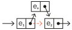

# Assignment 2

This assignment is about a simple round robin algorithm that allocates CPU time to tasks held in cyclic list.

The assignment provides the round robin algorithm, but asks you to implement the library functions needed to run it.

## Instructions

This assignment is worth 15% of the total grade.

Deadline for hand-in is Friday, November 22.

You may form groups of up to 4 students.

Each group submits their answer by sending me a link to a github repository via [email using this link](mailto:akurz@chapman.edu?subject=CPSC-354-Assignment-2).

**Make this a private github repository, so that your solution is not visible to other groups.**

If possible, use the same repository as for Assignment 1.

To assess your work, I will run the code in the file `/solution/round_robin.lc`, so make sure that the functions you implement all run as expected.

## Specification

The library will consist of the following functions.[^types] 


    newCList :: elem -> cList
    next :: cList -> cList
    get :: cList -> elem
    update :: elem, cList -> cList
    insert :: elem, cList -> cList
    delete :: cList -> cList

---

`newClist` takes an element and returns (the address of) a circular list of length 1 containing the element. The data structure looks like this, namely we use a pair `[e,a]`, where `e` is the element stored in the list and `a` is a pointer which points back at the pair    

&nbsp;&nbsp;&nbsp;&nbsp;&nbsp;&nbsp;

---

`next` takes (the address of) a circular list `a` and returns (the address of) the list after the current position. (This is similar to the tail of linked lists but it doesn't need a case for the empty list and it doesn't reduce the length of the list.)

---

**Remark:** In the following I drop the "(the address of)".

---

`get` takes a circular list `a` and returns the element at the current position. (This is similar to the head of linked lists.)

---

`update` takes an element `e` and a circular list `a` and replaces the element at the current position of `a` with `e`.

---

`insert` takes an element `e` and a circular list `a` and inserts `e` after the current element. 

|            Before                   |               After                 |
|:-----------------------------------:|:-----------------------------------:|
|||

---

`delete` takes a circular list `a` and "deletes" the element after the current element of `a` (if it exists) by reassigning the pointer of `a` pointing to the successor. In particular, deleting from the one-element cyclic list does not change the list. 

|            Before                   |               After                 |
|:-----------------------------------:|:-----------------------------------:|
|||

---

## Testing

We provided a function `testRRobin` that you should use to test your library functions. Here is an example:

```
λ testRRobin [addTask 6];;
[6]
λ testRRobin [addTask 6,tick,tick];;
[4]
```

Adding a task of "size" 6 and then waiting for two "clock cycles" leaves us with a task of size 4.

```
λ testRRobin [addTask 6,tick,tick,addTask 5];;
[5, 4]
```

Adding another task, puts it in front of the cyclic list. Then waiting for one more clock cycle reduces the size of the next task by one:

```
λ testRRobin [addTask 6,tick,tick,addTask 5,tick];;
[3, 5]
```

Note that waiting for one clock cycle moves the last task in the cyclic list to the front.

**Exercise:** Predict the results of
```
λ testRRobin [addTask 6,tick,tick,addTask 5,tick,tick,tick];;
```

**Explanation:** The testing uses the following functions provided with `round_robin.lc`.
- The function `roundRobin` takes a list `ts` of tasks such as `[addTask 6,tick,tick,addTask 5,tick]`, or just `[6,0,0,5,0]` for short, and takes a cyclic list `a` and simulates a round robin algorithm that inserts the tasks into the cyclic list and, for each `tick`, reduces the current task by 1 and goes on to the next task.
- The function `testRRobin` takes a list of tasks, calls `roundRobin` with this list of tasks on the cyclic list containing 0, and then converts the resulting cyclic list into an ordinary list.

[^types]: `LambdaFun` has no built-in types. The types are listed only for documentation purposes. Also note that the type `clist` represents references (pointers, addresses) to circular lists. These are not functions in the mathematical sense that can be understood as transforming inputs to outputs. Rather they work by their side-effects on memory.
